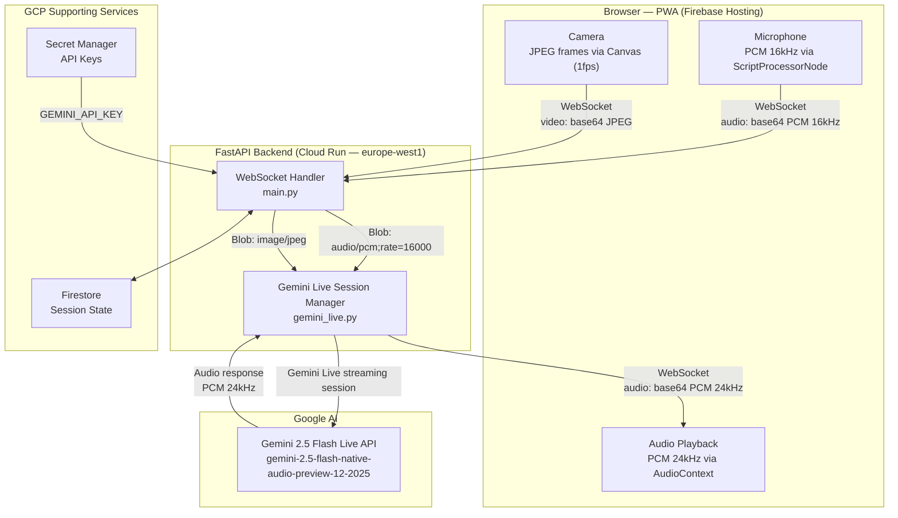

# SeeMe Tutor

**The AI tutor that sees your homework, hears your confusion, and speaks your language.**

[](https://seeme-tutor.web.app)
[](https://console.cloud.google.com/run)
[](https://ai.google.dev/)

---

## What Is SeeMe Tutor?

SeeMe Tutor is a real-time multimodal AI tutoring application built on the **Gemini 2.5 Flash Live API**. It sees your homework through the camera, hears your questions through the microphone, and guides you — in your own language — using the Socratic method. It never just gives you the answer.

**Key differentiators:**

- **Live Vision** — Continuous camera feed lets the tutor see what you're working on in real time, not just a snapshot
- **Natural Voice** — Full-duplex audio with no push-to-talk; interrupt naturally and the tutor adapts immediately
- **Socratic Method** — Guides students to discover answers themselves; never gives the solution directly
- **Multilingual** — Auto-detects Portuguese, German, and English; switches mid-session without configuration
- **Emotional Adaptation** — Detects frustration or confidence in the student's voice and adjusts pace and tone accordingly

---

## Architecture



---

## Quick Start

Get SeeMe Tutor running locally in three steps.

```bash
# 1. Clone the repository
git clone https://github.com/YOUR_USERNAME/seeme-tutor.git
cd seeme-tutor

# 2. Configure your API key
cp .env.example .env
# Open .env and set: GEMINI_API_KEY=your_key_here

# 3. Install dependencies and run
cd backend
pip install -r requirements.txt
GEMINI_API_KEY=your_key uvicorn main:app --reload --port 8000
```

Open [http://localhost:8000](http://localhost:8000) in your browser. Allow microphone and camera access when prompted.

---

## Prerequisites

| Requirement | Details |
|-------------|---------|
| Python | 3.12 or higher |
| Gemini API key | Free at [aistudio.google.com/apikey](https://aistudio.google.com/apikey) |
| Modern browser | Chrome or Edge recommended (WebRTC + AudioContext support) |
| HTTPS or localhost | Camera/mic APIs require a secure context |

**For GCP deployment (optional):**

- `gcloud` CLI — [install guide](https://cloud.google.com/sdk/docs/install)
- `firebase` CLI — `npm install -g firebase-tools`
- A GCP project with billing enabled

---

## Full Setup Guide

### Get a Gemini API Key

1. Go to [aistudio.google.com/apikey](https://aistudio.google.com/apikey)
2. Click **Create API key**
3. Copy the key — you will use it in `.env` for local development and in Secret Manager for production

### Local Development

```bash
# Clone and enter the repo
git clone https://github.com/YOUR_USERNAME/seeme-tutor.git
cd seeme-tutor

# Create and activate a virtual environment
cd backend
python3 -m venv .venv
source .venv/bin/activate        # Windows: .venv\Scripts\activate

# Install dependencies
pip install -r requirements.txt

# Set your API key and start the server
GEMINI_API_KEY=your_key_here uvicorn main:app --reload --port 8000
```

The FastAPI server serves the frontend at `http://localhost:8000` and exposes a WebSocket at `ws://localhost:8000/ws`.

**Mac users:** If you want to run local audio test scripts, install PortAudio first:

```bash
brew install portaudio
```

### GCP Deployment

Use the included deploy script for a one-command deployment to Cloud Run and Firebase Hosting:

```bash
chmod +x deploy.sh
./deploy.sh
```

The script handles everything listed in the [Deployment to GCP](#deployment-to-gcp) section below.

### GCP Services Setup

If you are deploying to your own GCP project, enable the required APIs and create a service account:

```bash
# Set your project
export PROJECT_ID=your-project-id
gcloud config set project $PROJECT_ID

# Enable required APIs
gcloud services enable \
  run.googleapis.com \
  cloudbuild.googleapis.com \
  firestore.googleapis.com \
  secretmanager.googleapis.com \
  artifactregistry.googleapis.com \
  aiplatform.googleapis.com

# Create a service account
gcloud iam service-accounts create seeme-tutor-sa \
  --display-name="SeeMe Tutor Service Account"

# Grant required roles
gcloud projects add-iam-policy-binding $PROJECT_ID \
  --member="serviceAccount:seeme-tutor-sa@$PROJECT_ID.iam.gserviceaccount.com" \
  --role="roles/secretmanager.secretAccessor"

gcloud projects add-iam-policy-binding $PROJECT_ID \
  --member="serviceAccount:seeme-tutor-sa@$PROJECT_ID.iam.gserviceaccount.com" \
  --role="roles/datastore.user"

# Store the Gemini API key in Secret Manager
echo -n "your_gemini_api_key_here" | \
  gcloud secrets create gemini-api-key --data-file=-
```

---

## Project Structure

```
seeme-tutor/
├── backend/
│   ├── main.py           # FastAPI app + WebSocket endpoint
│   ├── gemini_live.py    # Gemini Live API session management
│   ├── requirements.txt  # Python dependencies
│   └── Dockerfile        # Container image for Cloud Run
├── frontend/
│   └── index.html        # PWA: mic capture, camera, audio playback
├── infrastructure/
│   └── gcp_services.py   # Demonstrates GCP service usage for judges
├── deploy.sh             # One-command deploy to Cloud Run + Firebase
├── .env.example          # Environment variable template
└── README.md
```

---

## How It Works — Technical Pipeline

SeeMe Tutor runs a real-time bidirectional pipeline between the browser and Gemini:

1. **Mic capture** — The browser uses a `ScriptProcessorNode` to capture raw PCM audio at 16kHz from the system microphone. Audio chunks are base64-encoded and sent to the backend over WebSocket as JSON.

2. **Camera capture** — Three times per second, the browser draws the current camera frame to an HTML5 canvas, exports it as a JPEG, base64-encodes it, and sends it to the backend alongside the audio stream.

3. **WebSocket bridge** — The FastAPI backend receives the combined audio and video stream. It maintains one persistent WebSocket connection per user session and forwards data into an active Gemini Live API session.

4. **Gemini Live session** — `gemini_live.py` manages the bidirectional Gemini streaming session. Audio chunks are forwarded as `types.Blob(data=audio_bytes, mime_type="audio/pcm;rate=16000")` and video frames as `types.Blob(data=frame_bytes, mime_type="image/jpeg")` using `session.send_realtime_input()`.

5. **Response audio** — Gemini returns audio responses as PCM at 24kHz. The backend streams these back to the browser over the WebSocket.

6. **Browser playback** — The browser decodes the incoming PCM data and schedules it for gapless playback using the Web Audio API's `AudioContext`, with timestamps tracked to avoid buffer underruns.

7. **Session state** — Firestore stores session metadata (start time, duration, language detected, end reason) for analytics and GCP service integration.

---

## Tutor Persona

SeeMe is a patient, encouraging tutor with a calm and warm voice. It adapts to the student in front of it — not just the subject matter.

**Core teaching principles:**

- **Never gives the answer directly.** SeeMe always responds with a guiding question: "What do you think happens when you multiply both sides by the same number?"
- **References what it can see.** If it can read your handwriting: "I can see you've written 3x on the left side — what would you need to do to isolate x?"
- **Matches your language.** Start speaking Portuguese, it responds in Portuguese. Switch to English mid-sentence, it follows. German works too.
- **Reads the emotional room.** If a student sounds frustrated, SeeMe slows down, offers encouragement, and breaks the problem into smaller steps. If they sound confident, it moves faster and challenges them more.
- **Handles interruptions naturally.** Because Gemini Live API is full-duplex, students can interrupt mid-response and SeeMe will stop, acknowledge, and re-approach — just like a real tutor would.

---

## Deployment to GCP

```bash
./deploy.sh
```

The deploy script performs the following steps automatically:

- Builds the Docker container image using Cloud Build
- Pushes the image to Artifact Registry
- Deploys the container to Cloud Run in `europe-west1`
- Binds `GEMINI_API_KEY` as a Cloud Run secret reference to Secret Manager
- Runs `firebase deploy` to publish the frontend PWA to Firebase Hosting
- Prints the live URLs for both the backend and frontend

After deployment:
- **Frontend:** `https://seeme-tutor.web.app`
- **Backend WebSocket:** `wss://seeme-tutor-[hash]-ew.a.run.app/ws`

---

## GCP Services Used

| GCP Service | How It Is Used |
|-------------|---------------|
| **Gemini 2.5 Flash Live API** | Core AI engine — real-time bidirectional audio and video streaming, multilingual response generation, Socratic tutoring logic |
| **Cloud Run** | Serverless hosting for the FastAPI WebSocket backend; auto-scales to zero when idle, scales up on demand |
| **Firebase Hosting** | Hosts the PWA frontend on a global CDN; serves over HTTPS (required for camera/mic browser APIs) |
| **Firestore** | Stores session metadata (start time, duration, language detected, end reason) for analytics |
| **Secret Manager** | Stores the Gemini API key securely; Cloud Run mounts the secret at runtime via `--set-secrets` binding |
| **Cloud Build** | Builds the Docker container image from source on each deploy; no local Docker daemon required |
| **Artifact Registry** | Stores built container images; used as the image source for Cloud Run deployments |

---

## Environment Variables

Copy `.env.example` to `.env` and fill in the values:

```
GEMINI_API_KEY=        # Your Gemini Developer API key
GCP_PROJECT_ID=seeme-tutor
GCP_REGION=europe-west1
FIRESTORE_COLLECTION=sessions
```

In production (Cloud Run), `GEMINI_API_KEY` is mounted from Secret Manager via `--set-secrets` and the other variables are set as Cloud Run environment variables.

---

## Hackathon Submission Notes

SeeMe Tutor was built for the **Gemini Live Agent Challenge** hosted by Google.

**Technology stack:** 100% Google and GCP.
- AI: Gemini 2.5 Flash Live API (`gemini-2.5-flash-native-audio-preview-12-2025`) via the `google-genai` Python SDK
- Backend: FastAPI on Cloud Run
- Frontend: Firebase Hosting
- Database: Firestore
- Secrets: Secret Manager

No third-party AI APIs are used. The entire intelligence layer runs through Google's Gemini platform.

---

## License

MIT License — see [LICENSE](LICENSE) for details.
