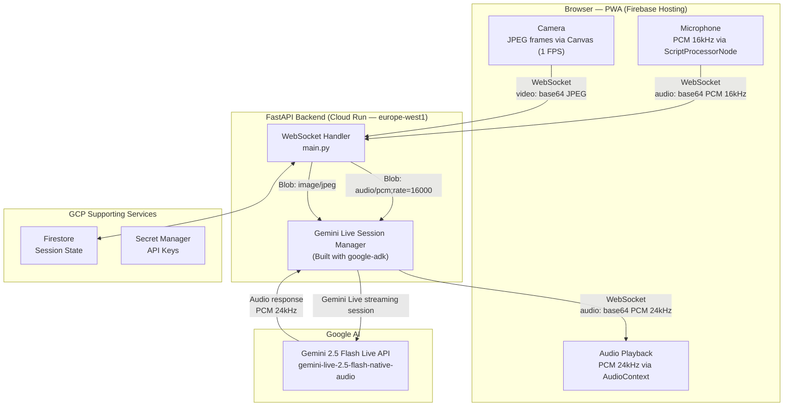

# SeeMe Tutor

**The AI Study Companion That Sees Your Work, Hears Your Questions, and Guides You to Mastery**

[](https://seeme-tutor.web.app)
[](https://console.cloud.google.com/run)
[](https://ai.google.dev/)

---

## What Is SeeMe Tutor?

SeeMe Tutor is a real-time multimodal AI study companion built on the **Gemini 2.5 Flash Live API**. Pick your profile, point your camera at your work, talk naturally, and get step-by-step study guidance in your language — with a tutor that already knows your topic and verifies you truly understand before moving on.

**Key differentiators:**

- **Proactive Visual Co-pilot** — Doesn't wait to be asked. Actively watches through the camera and comments on mistakes, completed steps, and progress in real time
- **Live Vision** — Continuous camera feed lets the tutor see what you're working on in real time, not just a snapshot
- **Natural Voice** — Full-duplex audio with sub-500ms response latency; interrupt naturally and the tutor adapts immediately
- **Socratic Method** — Guides students to discover answers themselves; never gives the solution directly
- **Mastery Verification** — 3-step protocol (solve, explain, transfer) ensures real understanding before marking anything as mastered
- **Topic Context** — Pre-loaded domain knowledge per topic via Google Search; the tutor starts knowledgeable about your specific material
- **Multilingual** — Auto-detects Portuguese, German, French, and English; responds in whatever language the student speaks
- **Emotional Adaptation** — Detects frustration or confidence in the student's voice and adjusts pace and tone accordingly
- **3 Demo Profiles** — Luis (German A2), Sofia (Grade 4 Math/French), Ana (University Chemistry) — same app, different subjects, different languages
- **Privacy by Design** — Consent screen before session start, anonymized session data, voice-only option (camera toggle), and transparent data handling

---

## Quick Start (for Judges)

1. Open the app: [https://seeme-tutor.web.app](https://seeme-tutor.web.app)
2. Pick a student profile (3 pre-loaded: Luis/German, Sofia/Math, Ana/Chemistry)
3. Allow microphone and camera when prompted
4. Start talking — ask about the current topic, show exercises on camera, or just chat
5. The tutor knows the study context and will guide you through exercises
6. Try the mastery check: solve an exercise, then see if the tutor asks you to explain and transfer

**Test credentials:** No login required. Just pick a profile and start.

---

## Five Key Moments (What Must Be Obvious in the Demo)

1. **Proactive vision:** Tutor catches a visible mistake without being asked.
2. **Affective/Emotional:** Tutor hears frustration (a sigh, a pause), shifts tone, and de-escalates.
3. **Interruption handling:** Student interrupts mid-response; tutor stops immediately and re-approaches.
4. **Multilingual:** Same app, three profiles, three languages (DE, PT, FR) — tutor auto-detects and responds naturally.
5. **Mastery verification:** Tutor doesn't just check answers — asks the student to EXPLAIN why their answer works, then gives a TRANSFER problem. Only then is it marked mastered.

---

## Architecture


```mermaid
flowchart TD
    subgraph Browser["Browser — PWA (Firebase Hosting)"]
        MIC["Microphone\nPCM 16kHz via ScriptProcessorNode"]
        CAM["Camera\nJPEG frames via Canvas (1 FPS)"]
        PLAY["Audio Playback\nPCM 24kHz via AudioContext"]
    end

    subgraph Backend["FastAPI Backend (Cloud Run — europe-west1)"]
        WS["WebSocket Handler\nmain.py"]
        GL["Gemini Live Session Manager\n(Built with google-adk)"]
    end

    subgraph Google["Google AI"]
        GEMINI["Gemini 2.5 Flash Live API\ngemini-live-2.5-flash-native-audio"]
    end

    subgraph GCP["GCP Supporting Services"]
        FS["Firestore\nSession State"]
        SM["Secret Manager\nAPI Keys"]
    end

    MIC -- "WebSocket\naudio: base64 PCM 16kHz" --> WS
    CAM -- "WebSocket\nvideo: base64 JPEG" --> WS
    WS -- "Blob: audio/pcm;rate=16000" --> GL
    WS -- "Blob: image/jpeg" --> GL
    GL -- "Gemini Live streaming session" --> GEMINI
    GEMINI -- "Audio response\nPCM 24kHz" --> GL
    GL -- "WebSocket\naudio: base64 PCM 24kHz" --> PLAY
    WS <--> FS
```

---

## Quick Start

Get SeeMe Tutor running locally in three steps.

```bash
# 1. Clone the repository
git clone https://github.com/luistatera/seeme-tutor.git
cd seeme-tutor

# 2. Configure Environment (Optional)
cp .env.example .env
# Open .env and set overrides if needed

# 3. Authenticate with Google Cloud
gcloud auth application-default login

# 4. Install dependencies and run
cd backend
pip install -r requirements.txt
uvicorn main:app --reload --port 8000
```

Open [http://localhost:8000](http://localhost:8000) in your browser. Allow microphone and camera access when prompted.

---

## Prerequisites

| Requirement | Details |
|-------------|---------|
| Python | 3.12 or higher |
| Modern browser | Chrome or Edge recommended (WebRTC + AudioContext support) |
| HTTPS or localhost | Camera/mic APIs require a secure context |

**For GCP deployment (optional):**

- `gcloud` CLI — [install guide](https://cloud.google.com/sdk/docs/install)
- `firebase` CLI — `npm install -g firebase-tools`
- A GCP project with billing enabled

---

## Full Setup Guide

### Authenticate with Google Cloud

This application uses Vertex AI. Before running locally, you must authenticate:

1. Ensure the Google Cloud CLI (`gcloud`) is installed.
2. Run `gcloud auth application-default login`

### Local Development

```bash
# Clone and enter the repo
git clone https://github.com/luistatera/seeme-tutor.git
cd seeme-tutor

# Create and activate a virtual environment
cd backend
python3 -m venv .venv
source .venv/bin/activate        # Windows: .venv\Scripts\activate

# Install dependencies
pip install -r requirements.txt

# Start the server
uvicorn main:app --reload --port 8000
```

The FastAPI server serves the frontend at `http://localhost:8000` and exposes a WebSocket at `ws://localhost:8000/ws`.

**Mac users:** If you want to run local audio test scripts, install PortAudio first:

```bash
brew install portaudio
```

### GCP Deployment

Use the included deploy script for a one-command deployment to Cloud Run and Firebase Hosting:

```bash
chmod +x deploy.sh
./deploy.sh
```

The script handles everything listed in the [Deployment to GCP](#deployment-to-gcp) section below.

### GCP Services Setup

If you are deploying to your own GCP project, enable the required APIs and create a service account:

```bash
# Set your project
export PROJECT_ID=your-project-id
gcloud config set project $PROJECT_ID

# Enable required APIs
gcloud services enable \
  run.googleapis.com \
  cloudbuild.googleapis.com \
  firestore.googleapis.com \
  secretmanager.googleapis.com \
  artifactregistry.googleapis.com \
  aiplatform.googleapis.com

# Create a service account
gcloud iam service-accounts create seeme-tutor-sa \
  --display-name="SeeMe Tutor Service Account"

# Grant required roles
gcloud projects add-iam-policy-binding $PROJECT_ID \
  --member="serviceAccount:seeme-tutor-sa@$PROJECT_ID.iam.gserviceaccount.com" \
  --role="roles/secretmanager.secretAccessor"

gcloud projects add-iam-policy-binding $PROJECT_ID \
  --member="serviceAccount:seeme-tutor-sa@$PROJECT_ID.iam.gserviceaccount.com" \
  --role="roles/datastore.user"
```

---

## Project Structure

```
seeme-tutor/
├── backend/
│   ├── main.py                  # FastAPI app + WebSocket + ADK Runner
│   ├── agent.py                 # ADK Agent with Socratic tools + system prompt
│   ├── seed_demo_profiles.py    # Seed 3 demo profiles into Firestore
│   ├── test_report.py           # Session metrics + PRD scorecard
│   ├── modules/
│   │   ├── language.py          # Language detection (auto mode)
│   │   ├── proactive.py         # Proactive vision observation
│   │   ├── screen_share.py      # Screen share toggle
│   │   ├── whiteboard.py        # Whiteboard note normalization
│   │   └── resource_ingestion.py # YouTube transcript ingestion
│   ├── tests/                   # Pytest test suite
│   ├── requirements.txt
│   └── Dockerfile
├── frontend/
│   └── index.html               # PWA: mic, camera, whiteboard, profile picker
├── deploy.sh                    # One-command deploy to Cloud Run + Firebase
├── .env.example
└── README.md
```

---

## How It Works — Technical Pipeline

SeeMe Tutor runs a real-time bidirectional pipeline between the browser and Gemini:

1. **Mic capture** — The browser uses a `ScriptProcessorNode` to capture raw PCM audio at 16kHz from the system microphone. Audio chunks are base64-encoded and sent to the backend over WebSocket as JSON.

2. **Camera capture** — The browser draws the current camera frame to an HTML5 canvas at 1 FPS, exports it as a JPEG, base64-encodes it, and sends it to the backend alongside the audio stream.

3. **WebSocket bridge** — The FastAPI backend receives the combined audio and video stream. It maintains one persistent WebSocket connection per user session and forwards data into an active Gemini Live API session.

4. **Gemini Live session** — The backend uses the **Google Agent Development Kit (ADK)** to manage the bidirectional Gemini streaming session. The ADK handles tool routing (e.g., dictionary lookups) and maintains the multi-turn conversation state. Audio chunks are forwarded to the model and video frames as images.

5. **Response audio** — Gemini returns audio responses as PCM at 24kHz. The backend streams these back to the browser over the WebSocket.

6. **Browser playback** — The browser decodes the incoming PCM data and schedules it for gapless playback using the Web Audio API's `AudioContext`, with timestamps tracked to avoid buffer underruns.

7. **Session state** — Firestore stores session metadata (start time, duration, language detected, end reason) for analytics and GCP service integration.

---

## Tutor Persona — LearnLM-Informed Pedagogy

SeeMe is a patient, encouraging tutor with a calm and warm voice. Its pedagogical design is grounded in Google's [LearnLM](https://ai.google.dev/gemini-api/docs/learnlm) learning science principles — research-backed guidelines for effective AI-assisted education. Built on Gemini 2.5 Flash, which has LearnLM capabilities natively infused, SeeMe aligns with all five core learning principles:

- **Active Learning** — Never gives the answer directly. SeeMe always responds with a guiding question: "What do you think happens when you multiply both sides by the same number?"
- **Cognitive Load Management** — Employs **progressive disclosure** (highlighting only the most critical error first rather than overwhelming the student) and keeps responses concise (2–3 sentences) while referencing what it can see in the student's work to stay grounded in context.
- **Learner Adaptation** — Reads the emotional room. If a student sounds frustrated, SeeMe slows down and breaks the problem into smaller steps. If they sound confident, it increases the challenge.
- **Curiosity Stimulation** — Connects solved problems to real-world contexts and asks "what if" questions to extend thinking beyond the immediate exercise.
- **Metacognitive Development** — Prompts students to reflect on their own thinking: "You got that one — what strategy did you use?" Builds independent learning skills, not just subject knowledge.

**Additional capabilities:**

- **Proactive observation** — Actively monitors the camera feed and comments without being asked. Catches mistakes in real time ("I see something in that second line — want to take another look?"), congratulates completed steps, and guides next actions — like having a tutor looking over your shoulder.
- **Visual grounding** — References what it sees via the camera: "I can see you've written 3x on the left side — what would you need to do to isolate x?"
- **Silence handling** — When a student goes quiet, checks in after a natural pause: "Still working on it? Take your time." Stays present without being pushy.
- **Multilingual** — Start speaking Portuguese, it responds in Portuguese. Switch to German or French, it follows naturally.
- **Mastery verification** — Before marking any exercise as mastered, the tutor runs a 3-step protocol: solve correctly, explain why it works, then solve a transfer problem. Real understanding, not checkbox completion.
- **Natural interruptions** — Because Gemini Live API is full-duplex, students can interrupt mid-response and SeeMe will stop, acknowledge, and re-approach — just like a real tutor would.

---

## Child Safety and Data Trust

SeeMe Tutor is designed for families and educational use. Data handling is minimal by design:

**What is stored:**

- Firestore session metadata only: session ID, start time, duration, detected language, end reason
- Anonymized client identifier (hashed IP — raw IPs are never persisted)

**What is NOT stored:**

- No audio recordings
- No video frames or screenshots
- No conversation transcripts
- No personal data (name, age, school, etc.)

**Educational scope:**

- The tutor's system instructions restrict it to educational topics — it will redirect non-educational requests back to learning
- Socratic method ensures the tutor guides rather than provides answers, keeping the student in the driver's seat

**Supervised use:**

- SeeMe is designed to be used with a parent or guardian present
- A consent screen is shown before each session begins
- Sessions are capped at 20 minutes to encourage focused, supervised study time

---

## Deployment to GCP

```bash
./deploy.sh
```

The deploy script performs the following steps automatically:

- Builds the Docker container image using Cloud Build
- Pushes the image to Artifact Registry
- Deploys the container to Cloud Run in `europe-west1`
- Runs `firebase deploy` to publish the frontend PWA to Firebase Hosting
- Prints the live URLs for both the backend and frontend

After deployment:

- **Frontend:** `https://seeme-tutor.web.app`
- **Backend WebSocket:** `wss://seeme-tutor-[hash]-ew.a.run.app/ws`

---

## GCP Services Used

| GCP Service | How It Is Used |
|-------------|---------------|
| **Gemini 2.5 Flash Live API** | Core AI engine — real-time bidirectional audio and video streaming, multilingual response generation, Socratic tutoring logic |
| **Google ADK** | Agent Development Kit orchestrates the streaming session, routes tool calls, and manages state |
| **Cloud Run** | Serverless hosting for the FastAPI WebSocket backend; auto-scales to zero when idle, scales up on demand |
| **Firebase Hosting** | Hosts the PWA frontend on a global CDN; serves over HTTPS (required for camera/mic browser APIs) |
| **Firestore** | Stores student profiles, learning tracks, topics, session metadata, and progress; enables session resumption and cross-session memory |
| **Google Search** | Pre-loads domain knowledge per study topic via ADK tool; tutor starts sessions already knowledgeable about the student's material |
| **Secret Manager** | Stores secrets like `DEMO_ACCESS_CODE` securely; Cloud Run mounts the secret at runtime via `--set-secrets` binding |
| **Cloud Build** | Builds the Docker container image from source on each deploy; no local Docker daemon required |
| **Artifact Registry** | Stores built container images; used as the image source for Cloud Run deployments |

---

## Environment Variables

Copy `.env.example` to `.env` and fill in the values:

```
GCP_PROJECT_ID=seeme-tutor
GCP_REGION=europe-west1
FIRESTORE_COLLECTION=sessions
```

In production (Cloud Run), `DEMO_ACCESS_CODE` is mounted from Secret Manager via `--set-secrets` and the other variables are set as Cloud Run environment variables.

---

## Troubleshooting

| Issue | Solution |
|-------|----------|
| **Microphone not working** | Click the lock/site-settings icon in the address bar and set Microphone to "Allow". Reload the page. |
| **Camera not working** | Same as above — ensure Camera is set to "Allow". On macOS, check System Preferences → Privacy → Camera. |
| **No audio from tutor** | Check that your browser tab is not muted (right-click the tab → Unmute). Ensure system volume is up. |
| **"Secure context required"** | Camera and mic APIs require HTTPS or `localhost`. Use `http://localhost:8000` for local dev, not a raw IP. |
| **WebSocket connection fails** | Verify the backend is running (`curl http://localhost:8000/health`). Check that your Application Default Credentials are set. |
| **Browser not supported** | Use Chrome or Edge (latest version). Safari and Firefox have limited WebRTC/AudioContext support. |

---

## Hackathon Submission Notes

SeeMe Tutor was built for the **Gemini Live Agent Challenge** hosted by Google.

**Technology stack:** 100% Google and GCP.

- AI: Gemini 2.5 Flash Live API (`gemini-live-2.5-flash-native-audio`) via the `google-genai` Python SDK
- Agent Framework: Google Agent Development Kit (ADK) via `google-adk`
- Pedagogy: [LearnLM](https://cloud.google.com/solutions/learnlm)-informed system instructions aligned with Google's learning science research
- Backend: FastAPI on Cloud Run
- Frontend: Firebase Hosting
- Database: Firestore
- Secrets: Secret Manager

No third-party AI APIs are used. The entire intelligence layer runs through Google's Gemini platform, with pedagogical design grounded in [LearnLM's learning science principles](https://ai.google.dev/gemini-api/docs/learnlm).

### Judging Rubric — Evidence Map

| Criterion (Weight) | Evidence | Where to Find |
|---------------------|----------|---------------|
| **Innovation & Multimodal UX (40%)** | Proactive camera observation, natural interruption handling, multilingual switching (PT/DE/FR/EN), visual grounding, emotional adaptation, 3-step mastery verification, topic context via Google Search | Demo video + live test |
| **Technical Implementation (30%)** | Gemini 2.5 Flash Live API + ADK + Cloud Run + Firestore + Secret Manager + Google Search + automated deploy | `backend/`, `deploy.sh` |
| **Demo & Presentation (30%)** | Real family use case, 3 profiles, 3 subjects, 3 languages, mastery verification protocol, clear architecture diagram | Demo video |
| **Bonus: Published content (+0.6)** | Blog post | _TBD — link will be added_ |
| **Bonus: Automated deploy (+0.2)** | One-command deploy script | [`deploy.sh`](deploy.sh) |
| **Bonus: GDG profile (+0.2)** | Google Developer Group profile | _TBD — link will be added_ |

### Architecture Diagram

> **TODO:** Export the Mermaid diagram above to a PNG or SVG using [mermaid.live](https://mermaid.live), Excalidraw, or draw.io. Upload the exported image to the Devpost image carousel or include it in the repo as `architecture.png`.

### Performance Benchmarks

Measured over rehearsal sessions on the production Cloud Run deployment.

#### Response Latency

| Metric | Target | Measured |
|--------|--------|----------|
| First tutor audio after student stops speaking | < 500 ms | _TBD_ |
| Median response start latency | < 400 ms | _TBD_ |
| P95 response start latency | < 800 ms | _TBD_ |

#### Reliability

| Scenario | Target | Result |
|----------|--------|--------|
| Interruption stops tutor audio | 100% | _TBD_ |
| Proactive observation triggers on visible mistake | > 80% | _TBD_ |
| Language switch mid-session (PT ↔ EN ↔ DE) | 100% | _TBD_ |
| 20-minute session completes without error | > 95% | _TBD_ |

> **TODO:** Run 10+ rehearsal sessions on the deployed URL and fill in the measured values from the `LATENCY` log lines in Cloud Run logs.

### Screenshots

> **TODO:** Add a screenshot or GIF of a live session showing the tutor interface with camera feed, audio indicators, and tutor response. Capture from production after final UI polish.

---

## License

This project is licensed under the [Business Source License 1.1](LICENSE).
Non-commercial use (personal, educational, research, evaluation) is freely permitted.
For commercial licensing, contact luistatera@gmail.com.
