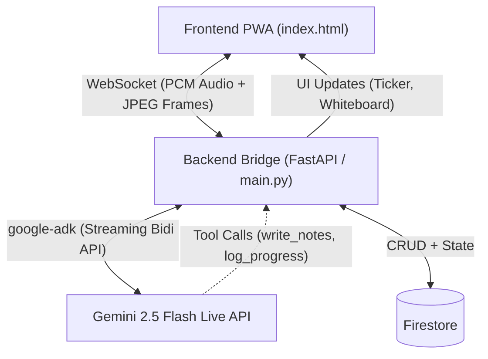

# SeeMe Tutor — Internal Architecture & Specification (Reverse-Engineered)

This document provides a comprehensive "inside look" at SeeMe Tutor, reverse-engineered from the current codebase. It details the high-level architecture, the component interactions, data flows, and the mechanics that drive the live tutoring experience.

---

## 1. High-Level Architecture

The application operates on a **three-tier architecture** heavily optimized for real-time streaming and high-latency tolerance.

### Components Summary

1. **Frontend (Client)**: A single-file Progressive Web App ([index.html](file:///Users/luisguimaraes/Projects/SeeMeTutor/frontend/index.html)) hosted on Firebase Hosting. It handles device media capture, local audio rendering, and UI state (the tutor tile, whiteboard, and reasoning ticker).
2. **Backend (Bridge/Orchestrator)**: A Python FastAPI application running on Cloud Run. It acts as a resilient middleman between the ephemeral browser connection and the Google ADK/Gemini API.
3. **Language Model**: Gemini 2.5 Flash Live API (`gemini-live-2.5-flash-native-audio`), orchestrated via `google-adk`.
4. **Database**: Firestore, used for storing long-term context (Sessions, Tracks, Student Profiles, Analytics, Memory).

---

## 2. The Frontend ([index.html](file:///Users/luisguimaraes/Projects/SeeMeTutor/frontend/index.html))

The frontend is intentionally lightweight and monolithic to minimize asset load times and dependency trees.

### Key Responsibilities

* **Media Capture**: Captures microphone audio (PCM 16-bit, 16kHz mono) and camera frames (JPEG at ~1 FPS).
* **WebSocket Management**: Maintains a persistent `wss://` connection to the Cloud Run backend.
* **UI Rendering**:
  * **Tutor Tile**: Displays the tutor's current state (Listening, Speaking, Thinking) with CSS animations (`pulse-dot`, wave bars).
  * **Reasoning Ticker**: Displays real-time agent state/trace emitted by the backend (e.g., `[Frustration detected -> De-escalating]`).
  * **Whiteboard**: A dynamic `flex` container that renders incoming `note-card` elements sent via the tutor's [write_notes](file:///Users/luisguimaraes/Projects/SeeMeTutor/backend/agent.py#1098-1268) tool.
* **Interruption Handling**: Senses local microphone voice activity to send an `interrupted: true` flag, preemptively clearing the local audio playback buffer for instant cut-off.

---

## 3. The Backend ([main.py](file:///Users/luisguimaraes/Projects/SeeMeTutor/backend/main.py))

This is the core nervous system of the app. It does not just pass messages; it actively manages the lifecycle and stability of the AI session.

### Critical Mechanics

* **Context Window Compression**:
    To prevent standard LLM token limits (Error 1011) over 20-minute sessions, the backend implements a sliding window compression. As tokens approach `LIVE_COMPRESSION_TARGET_TOKENS` (16,000), it summarizes older parts of the conversation and truncates the raw history to make room for new continuous context.
* **Session Resumption**:
    Browser WebSockets drop. When a student reconnects with the same session ID within a grace period, [main.py](file:///Users/luisguimaraes/Projects/SeeMeTutor/backend/main.py) rebuilds the ADK Agent context from Firestore and memory checkpoints, avoiding a complete "reboot" of the tutor's brain.
* **Memory Management**:
  * Checkpoints are saved every 5 minutes (`MEMORY_CHECKPOINT_INTERVAL_S = 300`).
  * Typed memory cells are pushed to `modules/memory_store.py` (Firestore).

---

## 4. The ADK Agent & Tools ([agent.py](file:///Users/luisguimaraes/Projects/SeeMeTutor/backend/agent.py))

The intelligence is structured around the `google-adk` framework. The system prompt forces "Socratic methodology" over direct answers. The model interacts with the app purely through defined tools.

### Mastery Verification Protocol

Instead of isolated questions, the tutor enforces a 3-step loop:

1. **Solve**: The student answers a problem.
2. **Explain**: The tutor asks "Why does that work?"
3. **Transfer**: The tutor provides a related problem to test abstraction.
Only after these three steps does the tool [verify_mastery_step](file:///Users/luisguimaraes/Projects/SeeMeTutor/backend/agent.py#1270-1377) allow the concept to be marked as mastered.

### Core ADK Tools (The "Tutor's Hands")

* [get_backlog_context](file:///Users/luisguimaraes/Projects/SeeMeTutor/backend/agent.py#775-804): Fetches the student's profile, language track, and prior topic context from Firestore before the session officially starts.
* [set_session_phase](file:///Users/luisguimaraes/Projects/SeeMeTutor/backend/agent.py#661-773): Manages the state machine (Greeting -> Capture -> Tutoring -> Review).
* [write_notes](file:///Users/luisguimaraes/Projects/SeeMeTutor/backend/agent.py#1098-1268): Extracts concepts discussed in audio and pushes them to the UI's Whiteboard as visual cards (e.g., formulas, vocab).
* [update_note_status](file:///Users/luisguimaraes/Projects/SeeMeTutor/backend/agent.py#1379-1491): Modifies whiteboard checklist items (`pending` -> `in_progress` -> `done`/`mastered`/`struggling`).
* [log_progress](file:///Users/luisguimaraes/Projects/SeeMeTutor/backend/agent.py#806-991): Commits learning milestones permanently to Firestore.
* [flag_drift](file:///Users/luisguimaraes/Projects/SeeMeTutor/backend/agent.py#1708-1767): Detects and flags when a student tries to cheat, go off-topic, or be inappropriate.

---

## 5. Data Models (Firestore)

While Firestore is NoSQL, the backend expects rigid structures for profiles and state.

* **Users/Students**: Stores details like Name, Age, and active Track (e.g., Luis / Adult / German A2).
* **Tracks & Topics**: Represents the curriculum. Each topic has a pre-loaded `context_summary` (usually gathered via Google Search beforehand) so the tutor is pre-primed with the textbook rules before the student even speaks.
* **Sessions**: Metadata about the session (start time, end time, duration, end reason).
* **Progress**: Granular records written by [log_progress](file:///Users/luisguimaraes/Projects/SeeMeTutor/backend/agent.py#806-991), aggregating the mastery of specific sub-topics.

---

## 6. End-to-End Latency & Performance Strategy

The architecture is built backwards from strictly defined latency constraints:

* **Student turn -> Tutor response**: Target < 500ms (achieved via unbuffered PCM streaming and Zero-copy binary pass-through).
* **Interruption -> Tutor stop**: Target < 200ms (Frontend zeroes audio buffer immediately upon local voice detection and sends interrupt flag to Gemini).
* **Visual Grounding**: Target < 1500ms for tutor to comment on a visual change in the camera feed.

## Conclusion

SeeMe Tutor is not a typical ChatBot. It is a live-streaming State Machine orchestration sitting between a WebRTC-like media stream and the Gemini Live API. By enforcing pedagogy via strict ADK Tools and protecting itself from overflow via Context Compression, it acts as a resilient, proactive teacher.
