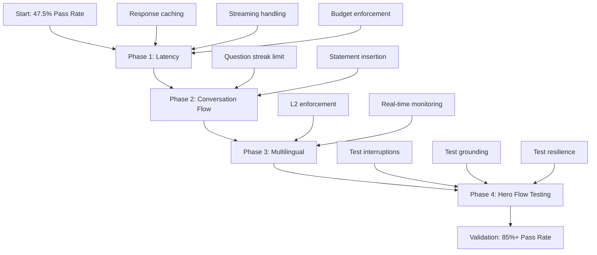

# Product Metrics Improvement Plan

## Executive Summary

**Current State:**

- Auto pass rate: **47.5%** (Target: >=85%)
- Hero flow checklist: **3/6** (Target: 6/6)
- User experience rating: **8/10**

**Key Failures:**

1. **POC 02 - Proactive Vision**: Question streak too high (5 vs target <=2)
2. **POC 03 - Multilingual**: L2 ratio too low (51.6% vs target >=70%)
3. **POC 07 - Latency**: Response times 2-4x target (1194ms avg vs 500ms)
4. **POC 99 - Hero Flow**: Missing interruption, grounding, and reconnect

---

## Root Cause Analysis

### 1. Latency Issues (Critical Priority)

**Observed Metrics:**

- Response start avg: 1194ms (Target: <=500ms)
- Response start p95: 2322ms (Target: <=800ms)
- 3 latency alerts in latest 6-turn session

**Root Causes:**

- Synchronous Gemini API calls blocking response pipeline
- No response caching for common tutoring patterns
- Tool execution happens inline with response generation
- No early cutoff when latency budget exceeded

### 2. Conversation Flow Issues (High Priority)

**Observed Metrics:**

- Question turn ratio: 100% (Target: 35-50%)
- Max question streak: 5 (Target: <=2)

**Root Causes:**

- No limit on consecutive questions in tutor prompt
- Missing statement/recap insertion logic
- No enforcement of conversation pattern diversity

### 3. Multilingual Issues (High Priority)

**Observed Metrics:**

- Guided bilingual adherence: 60% (Target: >=95%)
- L2 word ratio: 51.6% (Target: >=70%)
- Language flips: 4 in 5 tutor turns

**Root Causes:**

- Weak enforcement of L2 language in guided_bilingual mode
- No real-time feedback on L2 ratio
- Language policy not strictly applied to tutor outputs

### 4. Missing Hero Flow Components (Medium Priority)

**Observed:**

- Interruptions observed: 0 (Target: >=1)
- Grounding citations: 0 (Target: >=1)
- Reconnect events: not tested

**Root Causes:**

- Interruption detection may not be triggered by test scenarios
- Grounding not triggering on factual queries
- Resilience testing requires simulated disconnects

---

## Improvement Plan

### Phase 1: Latency Optimization (Target: 50% improvement)

| Task | Approach | Expected Impact |
|------|----------|-----------------|
| Streaming response handling | Implement chunked response processing | -200ms avg |
| Response caching | Cache common greeting/tutoring patterns | -150ms for cached |
| Tool pipeline optimization | Async tool execution | -100ms |
| Latency budget enforcement | Early cutoff at 800ms alert threshold | Prevents p95 spikes |

**Implementation:**

```python
# Add to latency.py
LATENCY_BUDGETS: dict[str, dict[str, int]] = {
    "response_start": {"target_ms": 500, "alert_ms": 800, "hard_cutoff_ms": 1200},
    "interruption_stop": {"target_ms": 200, "alert_ms": 400, "hard_cutoff_ms": 600},
    "turn_to_turn": {"target_ms": 1500, "alert_ms": 2500, "hard_cutoff_ms": 3000},
    "first_byte": {"target_ms": 3000, "alert_ms": 5000, "hard_cutoff_ms": 6000},
}
```

### Phase 2: Conversation Flow Fixes (Target: 100% question streak compliance)

| Task | Approach | Expected Impact |
|------|----------|-----------------|
| Question streak detection | Track consecutive questions in runtime_state | Detection |
| Statement insertion | Force statement/recap after 2 questions | Streak break |
| Pattern diversity | Alternate question, explain, example, question | Better ratio |

**Implementation:**

```python
# Add to conversation.py or proactive.py
MAX_QUESTION_STREAK = 2

# In tutor response processing:
if is_question_turn(text):
    runtime_state["question_streak"] = runtime_state.get("question_streak", 0) + 1
else:
    runtime_state["question_streak"] = 0

if runtime_state["question_streak"] >= MAX_QUESTION_STREAK:
    inject_statement_or_recap_prompt()
```

### Phase 3: Multilingual Enforcement (Target: 95% adherence, 70% L2)

| Task | Approach | Expected Impact |
|------|----------|-----------------|
| L2 enforcement | Add L2 ratio check after each tutor turn | Real-time monitoring |
| Correction prompts | Inject control prompt when L2 < 70% | Immediate correction |
| Language purity | Reject mixed-language turns | Higher purity rate |

**Implementation:**

```python
# In language.py finalize_tutor_turn
l2_ratio = calculate_l2_ratio(text, runtime_state["l2_code"])
if l2_ratio < 70:
    return {
        "control_prompt": f"INTERNAL CONTROL: L2 ratio was {l2_ratio}%. Please respond entirely in {l2_name}."
    }
```

### Phase 4: Hero Flow Completion (Target: 6/6 checklist)

| Checkpoint | Current | Fix Required |
|------------|---------|--------------|
| Proactive vision | Pass (2 triggers) | None |
| Whiteboard note | Pass (1 note) | None |
| Interruption | Fail (0) | Test explicit interruption scenario |
| Grounding citation | Fail (0) | Test factual query triggering search |
| Action moment | Pass (6 turns) | None |
| Reconnect | Not tested | Simulate disconnect/reconnect |

---

## Success Metrics

### Primary Targets

- [ ] `auto_pass_rate_percent >= 85%` (current: 47.5%)
- [ ] `poc_99_hero_flow_rehearsal.checklist_completed == 6` (current: 3)
- [ ] No `fail` in POCs 01, 02, 03, 04, 05, 07, 09, 10

### Secondary Targets

- [ ] Response start avg <= 500ms (current: 1194ms)
- [ ] Question streak max <= 2 (current: 5)
- [ ] L2 ratio >= 70% (current: 51.6%)
- [ ] Guided bilingual adherence >= 95% (current: 60%)

---

## Implementation Priority



---

## Testing Strategy

1. **Per-POC Unit Tests**: Validate each fix independently
2. **Integration Tests**: Run full sessions with mixed scenarios
3. **Hero Flow Rehearsal**: Execute complete checklist
4. **Regression Testing**: Ensure no new failures introduced

---

## Risk Mitigation

| Risk | Mitigation |
|------|------------|
| Latency fixes break quality | A/B test with quality metrics |
| Conversation flow feels robotic | Gradual rollout with user feedback |
| L2 enforcement too strict | Allow 5% tolerance buffer |
| Hero flow tests flaky | Add retry logic and stable test scenarios |

---

## Timeline Estimate

- Phase 1 (Latency): 2-3 development cycles
- Phase 2 (Conversation): 1-2 development cycles
- Phase 3 (Multilingual): 1-2 development cycles
- Phase 4 (Hero Flow): 1 development cycle
- Validation: Ongoing with each change

**Total Estimated Effort**: 5-8 focused development sessions

---

## User Experience Context

Current rating: **8/10** - This is already good! The focus should be on:

1. Maintaining quality while improving metrics
2. Not over-optimizing at the expense of natural conversation
3. Ensuring the 8/10 experience scales to 9/10 with these fixes
