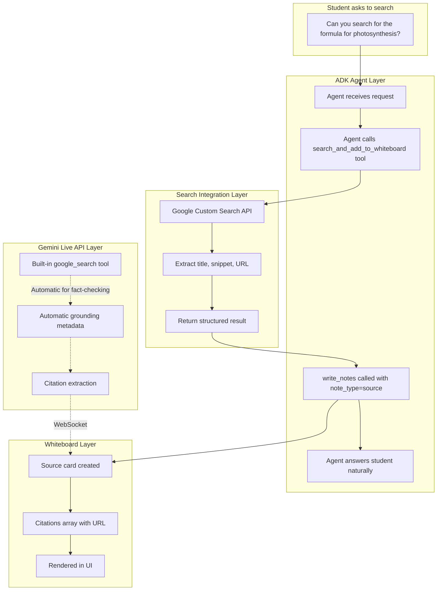

# Search Feature Implementation Plan

## Overview

Implement a Google Search tool for the SeeMe Tutor ADK agent that allows the tutor to:

1. Search for information when a student explicitly requests it
2. Pick the first relevant result
3. Answer the student's question using the search result
4. Add the result as a "source" card to the whiteboard

## Architecture

### Two-Layer Search Approach



## Implementation Components

### 1. Source Cards Module (`backend/modules/source_cards.py`)

**Purpose**: Normalize source-type whiteboard notes with citation metadata.

**Key Function**:

```python
def normalize_source_note(note: dict) -> dict:
    """Normalize a source note to include citations array."""
    # Extract URL from content if present
    # Format: "- Source: https://..." or similar patterns
    # Return note with citations array
```

**Output Format**:

```json
{
  "id": "note-123456",
  "title": "Search: Photosynthesis Formula",
  "content": "The overall process of photosynthesis can be represented by the equation: 6CO2 + 6H2O → C6H12O6 + 6O2",
  "note_type": "source",
  "status": "pending",
  "citations": [
    {
      "url": "https://www.khanacademy.org/science/biology/photosynthesis",
      "source": "Khan Academy",
      "snippet": "Photosynthesis converts light energy into chemical energy..."
    }
  ]
}
```

### 2. Search Module (`backend/modules/search.py`)

**Purpose**: Google Custom Search API integration.

**Key Functions**:

```python
async def search_google(query: str, num_results: int = 3) -> list[dict]:
    """
    Search Google using Custom Search API.
    Returns list of results with title, snippet, link, displayLink.
    """
    
def format_search_result_for_whiteboard(result: dict, query: str) -> dict:
    """
    Format a search result into a whiteboard-ready source note.
    """
```

**Environment Variables**:

- `GOOGLE_SEARCH_API_KEY` - Custom Search API key
- `GOOGLE_SEARCH_ENGINE_ID` - Programmable Search Engine ID

### 3. Search Grounding Module (`backend/modules/search_grounding.py`)

**Purpose**: Extract grounding metadata from Gemini Live API responses (for automatic search).

**Key Functions**:

```python
def extract_grounding_metadata(message) -> list[dict]:
    """
    Extract grounding citations from Gemini response.
    Checks: msg.server_content.grounding_metadata, msg.grounding_metadata
    """
    
def format_grounding_citation(chunk, queries: list) -> dict:
    """
    Format a grounding chunk into citation format.
    """
```

### 4. ADK Agent Tool (`backend/agent.py`)

**New Tool**:

```python
async def search_and_add_to_whiteboard(
    query: str,
    tool_context: ToolContext
) -> dict:
    """
    Search Google for information and add result to whiteboard.
    
    Use this when the student explicitly asks you to search for something.
    The tool will:
    1. Perform a Google search
    2. Add the top result as a source card to the whiteboard
    3. Return the result so you can answer the student
    
    Args:
        query: The search query (what to search for)
    
    Returns:
        Dict with search result including title, snippet, url, and confirmation
    """
    # Call search module
    # Call write_notes with note_type="source"
    # Return result for agent to use in response
```

**Add to TUTOR_TOOLS list**:

```python
TUTOR_TOOLS = [
    # ... existing tools ...
    search_and_add_to_whiteboard,
]
```

### 5. System Prompt Update

**Add to SYSTEM_PROMPT**:

```markdown
## Search Tool

You have access to Google Search via the `search_and_add_to_whiteboard` tool.

When to use:
- Student explicitly asks: "Can you search for...", "Look up...", "Find information about..."
- Student asks about current events, specific facts, or detailed explanations you don't have context for
- Student wants external resources or references

How to use:
1. Call `search_and_add_to_whiteboard` with the search query
2. The result is automatically added to the whiteboard as a source card
3. Answer the student naturally using the search result
4. Reference that the information is now on their whiteboard

Example:
Student: "Can you search for the photosynthesis formula?"
You: [Call search_and_add_to_whiteboard(query="photosynthesis formula")]
You: "I found it! The formula is 6CO2 + 6H2O → C6H12O6 + 6O2. I've added a source card to your whiteboard with more details."
```

### 6. Live API Config Update (`backend/main.py`)

**Update ADK_BASE_RUN_CONFIG** to include built-in Google Search:

```python
from google.genai import types

ADK_BASE_RUN_CONFIG = RunConfig(
    # ... existing config ...
    tools=[
        types.Tool(google_search=types.GoogleSearch())
    ],
)
```

This enables automatic search grounding for fact-checking (separate from explicit tool).

### 7. WebSocket Bridge Update (`backend/modules/ws_bridge.py`)

**Add grounding citation handling**:

```python
from modules.search_grounding import extract_grounding_metadata

# In the message processing loop:
citations = extract_grounding_metadata(message)
if citations:
    for citation in citations[:1]:  # Top citation only
        await send_json({
            "type": "grounding",
            "data": citation
        })
```

### 8. Frontend Handling (Already Exists)

The frontend already handles:

- `type: "whiteboard"` messages with `note_type: "source"`
- Citations array rendering
- `type: "grounding"` messages for automatic citations

## File Structure

```
backend/
├── modules/
│   ├── __init__.py
│   ├── source_cards.py          # NEW: Source card normalization
│   ├── search.py                 # NEW: Google Search API integration
│   ├── search_grounding.py       # NEW: Gemini grounding extraction
│   ├── whiteboard.py             # EXISTING: (needs source_cards import fix)
│   └── ws_bridge.py              # MODIFY: Add grounding handling
├── agent.py                      # MODIFY: Add search tool
├── main.py                       # MODIFY: Add google_search to config
└── requirements.txt              # MODIFY: Add google-api-python-client (if needed)
```

## Data Flow

### Explicit Search Flow (Tool-Based)

```
1. Student: "Search for Newton's laws"
   ↓
2. ADK Agent receives text
   ↓
3. Agent decides to call search_and_add_to_whiteboard("Newton's laws")
   ↓
4. Tool calls search_google() → returns results
   ↓
5. Tool calls write_notes(note_type="source", ...) 
   ↓
6. Whiteboard dispatcher sends to browser
   ↓
7. Tool returns result to agent
   ↓
8. Agent answers student with search result
```

### Automatic Grounding Flow (Gemini Built-in)

```
1. Student: "What's the capital of France?"
   ↓
2. Gemini Live API decides to search (built-in tool)
   ↓
3. Gemini returns response with grounding_metadata
   ↓
4. ws_bridge extracts citation from metadata
   ↓
5. ws_bridge sends {type: "grounding", data: citation} to browser
   ↓
6. Browser shows citation toast/card
   ↓
7. Student hears natural answer
```

## Environment Configuration

Add to `.env`:

```bash
# Google Search (for explicit search tool)
GOOGLE_SEARCH_API_KEY=your_api_key_here
GOOGLE_SEARCH_ENGINE_ID=your_search_engine_id

# Already configured (for Vertex AI)
GOOGLE_GENAI_USE_VERTEXAI=TRUE
GOOGLE_CLOUD_PROJECT=seeme-tutor
GOOGLE_CLOUD_LOCATION=europe-west1
```

## Testing Strategy

1. **Unit Tests**:
   - `test_search.py`: Mock Google Search API responses
   - `test_source_cards.py`: Test normalization of source notes
   - `test_search_grounding.py`: Test grounding metadata extraction

2. **Integration Tests**:
   - End-to-end search tool call
   - Whiteboard source card rendering
   - Grounding metadata extraction from mock Gemini response

3. **Manual Tests**:
   - Ask tutor to "search for photosynthesis"
   - Verify source card appears on whiteboard
   - Verify citation URL is clickable
   - Verify tutor answers naturally

## Success Criteria

- [ ] `search_and_add_to_whiteboard` tool is callable by ADK agent
- [ ] Search results appear as source cards on whiteboard
- [ ] Citations include URL, source name, and snippet
- [ ] Tutor answers naturally using search results
- [ ] Built-in Gemini grounding still works (automatic fact-checking)
- [ ] Both explicit tool and automatic grounding send citations to frontend
- [ ] No duplicate citations (tool-based and grounding for same query)

## Google Technologies Used

1. **Google ADK** - Agent framework and tool system
2. **Gemini Live API** - Multimodal streaming with built-in search
3. **Google Custom Search API** - Explicit search tool
4. **Vertex AI** - Model hosting and deployment
5. **Cloud Firestore** - Persist search history (optional)
